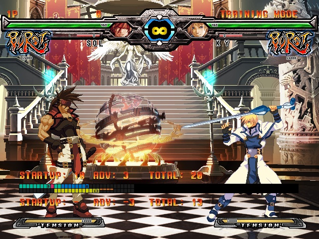
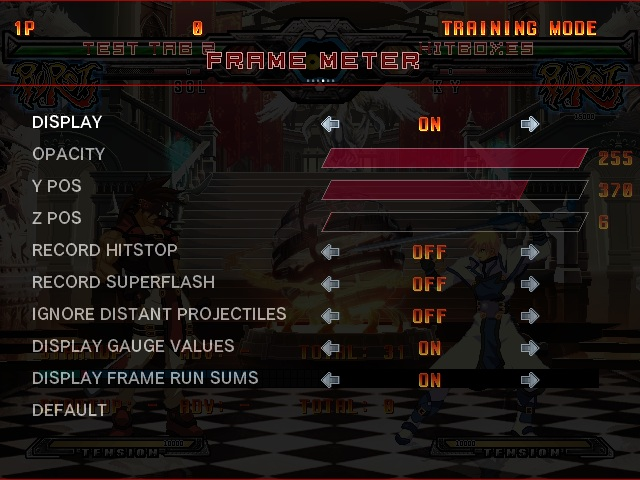

# ACPR_FrameMeter

Frame meter mod for Guilty Gear XX Accent Core Plus R (Steam) via [GearLoader](https://github.com/YouKnow232/GearLoader).

A partial port of [ggxxacpr_overlay](https://github.com/YouKnow232/ggxxacpr_overlay).

<div align="center">
  
  <br/>
</div>


## Installation

* Download and install [GearLoader](https://github.com/YouKnow232/GearLoader) v1.1.0 or newer.
* Download "FrameMeter.zip" from [releases](https://github.com/YouKnow232/ACPR_FrameMeter/releases)
* Unzip "FrameMeter.zip" and place the contents into the "mods" folder

```text
Guilty Gear XX Accent Core Plus R/
└── mods/
    └── FrameMeter/
```


## Frame Meter Legend
 Startup / Counter Hit State <br>
 Active <br>
 Recovery <br>
 Blockstun / Hitstun <br>
 Knockdown / Techable Hitstun <br>
 Movement <br>
### Under Lines
 FRC <br>
 Slash Back <br>
 Full Invuln <br>
 Throw Invuln Only <br>
 Strike Invuln Only <br>
 Armor / Guardpoint / Parry<br>


## Reading a FrameMeter
The frame meter is simply a timeline of [frames](https://glossary.infil.net/?t=Frame). There are two meters, one for each player, that can be compared with each other to help gauge [startup](https://glossary.infil.net/?t=Startup) and [advantage](https://glossary.infil.net/?t=Advantage) as well as other timing concepts. The frame meter color codes each frame based on the state the player character was in during that frame.


## Settings
<div align="center">
  
  <br/>
</div>

This mod features a settings menu that can be found at "Pause Menu -> Help & Options -> Mod Settings".


## Build Instructions
Build instructions are similar to [GearLoader's](https://github.com/YouKnow232/GearLoader).


### Prerequisites
* CMake v3.21 or later
* gcc v15.2.0 or later
    * i686-w64-mingw32-g++

For Windows users:
* MSYS2 environment


### Instructions
Run `Compile.sh` from the project root directory (in a MINGW32 shell for Windows users). You can set the environment variable `GGXXACPR_MOD_DIR` and the `Compile.sh` script will copy the build output to that directory.


## Known Issues
The white bracket startup indicators on the frame meter behave inconsistently for certain charged moves or moves with followups.
